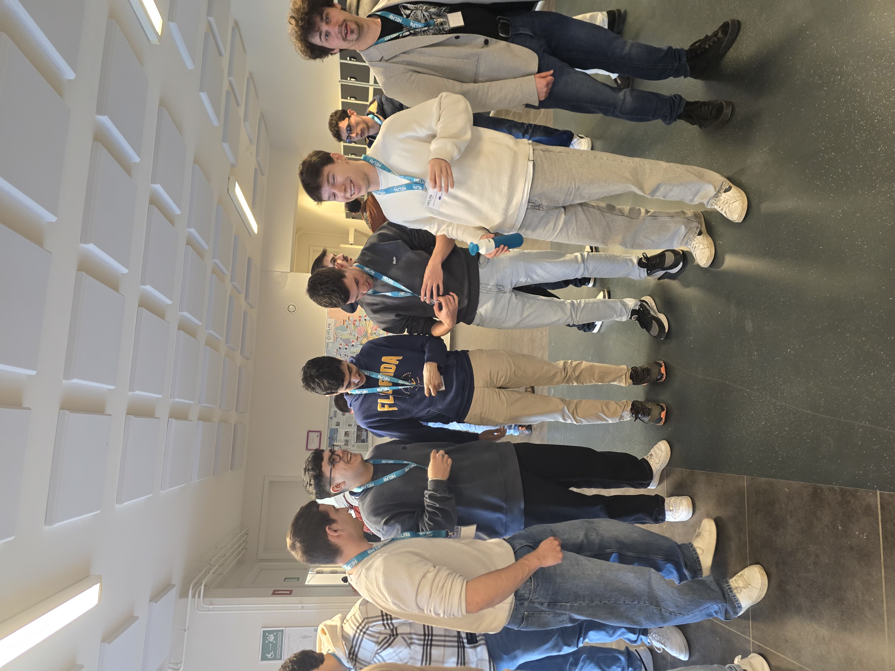

# 👋 Hi, I'm Lluís

## 🛠 Technical skills

I mainly work with C, C#, and Python. I also have some experience with R and MATLAB.  
My background is in biomedical engineering, and I particularly enjoy problems that involve mathematics, medical data, or electronics.

## 🤝 Soft skills

I’m comfortable working autonomously. 
I’m used to problem-solving under uncertainty.
Communication and reliability matter a lot to me. I try to be clear, honest, and direct when sharing ideas or progress. If I say I’ll do something, I make sure it gets done.

## 🏃 Hobbies

Sports have always been part of my life. I’ve played basketball since I was eight years old and spent several years as team captain. I enjoy trying new sports, and over time I’ve gravitated toward martial arts and, more recently, climbing walls. Every now and then, I like playing chess with friends or family.

I strongly enjoy social events at university such as hackathons, meetings, events... 

This is me with Xavier Verdaguer. 

## 🌍 Interests

I enjoy conversations that go beyond tech—especially about economics, humanities, and film. I like exchanging ideas and meeting people who are passionate about what they do. I try to travel whenever I have free time, I like discovering different cultures, spending time in nature, and exploring food.

During second course I was able to take a mobility program at Belgium, check it out:

The topic was VR integrating IMUs, ROS communication...

## 🧠 Personality

Curiosity defines me. I like experimenting, learning new things, and stepping into unfamiliar domains.

## 🎙 Hear me talking

I enjoy discussing ideas. I believe communication is a strong asset of mine.

- _Generación propósito_ presentation: https://youtu.be/LFLLcmZ8RyY  🇪🇸 ESP
-  _University job offer__ Requisite: Video on most common questions and what would I answer: https://youtu.be/hGNnXDFfdxU 🟡🔴 CAT

Thanks for your attention and hope you like my profile!
